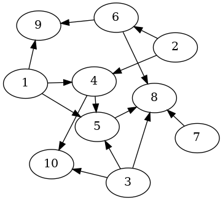

# Basic Graphs

*Graphite* provides two types for graphs: `UGraph` for undirected graphs and
`DGraph` for directed graphs.

Lets represent some graphs.

## Undirected graphs


```haskell
myGraph :: UGraph Int ()
myGraph = fromEdgesList
    [ 1 <-> 4
    , 1 <-> 5
    , 1 <-> 9
    , 2 <-> 4
    , 2 <-> 6
    , 3 <-> 5
    , 3 <-> 8
    , 3 <-> 10
    , 4 <-> 5
    , 4 <-> 10
    , 5 <-> 8
    , 6 <-> 8
    , 6 <-> 9
    , 7 <-> 8
    ]
```

The type `UGraph Int ()` here means that this is an undirected graph `UGraph`,
with vertices of type `Int` and edges with attributes of type `()`.

The `<->` operator constructs an *Undirected* `Edge` between to vertices.

The `fromEdgesList` function constructs an `UGraph` from a list of `Edge`s.


## Directed Graphs



```haskell
myGraph :: DGraph Int ()
myGraph = fromArcsList
    [ 1 --> 4
    , 1 --> 5
    , 1 --> 9
    , 2 --> 4
    , 2 --> 6
    , 3 --> 5
    , 3 --> 8
    , 3 --> 10
    , 4 --> 5
    , 4 --> 10
    , 5 --> 8
    , 6 --> 8
    , 6 --> 9
    , 7 --> 8
    ]
```

The type `DGraph Int ()` here means that this is a directed graph `DGraph`,
with vertices of type `Int` and edges with attributes of type `()`.

The `-->` operator constructs a *Directed* `Arc` between to vertices.

The `fromArcsList` function constructs a `DGraph` from a list of `Arc`s.


## Other vertex types

*Graphite* can use any `Hashable` type as the vertices of a graph, this way we
could have a graph of `Int`s, `Float`s, `Bool`s, `Char`s, `String`s,
`ByteString`s, `Text` and more.

Take for instance this undirected graph with `Float` vertices (parenthesis for
clarity):

```haskell
myGraph :: UGraph Float ()
myGraph = fromEdgesList [(1.3 <-> 2.5), (3.4 <-> 6.8), (7.4 <-> 4.4)]
```

Or this directed graph with `String` vertices:

```haskell
myGraph :: DGraph String ()
myGraph = fromArcsList ["Paper" --> "Rock", "Rock" --> "Scissors", "Scissors" -> "Paper"]
```


# Visualizing graphs

# Complex graphs - complex vertices, complex edges

## Visualizing edged graphs

# Working with graph-type independence
